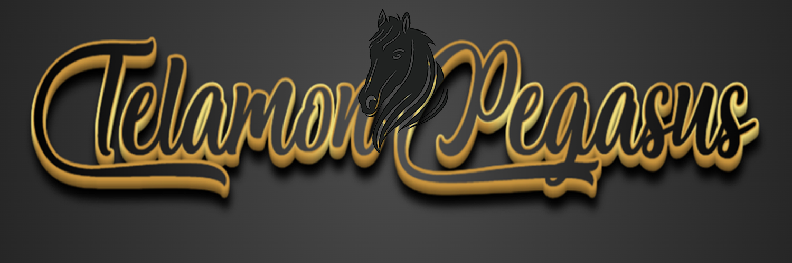

<!-- ### Hi there 👋 -->

<!--
**✨ _special_ ✨ repository because its `README.md` (this file) appears on your GitHub profile.

Here are some ideas to get you started:

- 🔭 I’m currently working on ...
- 🌱 I’m currently learning ...
- 👯 I’m looking to collaborate on ...
- 🤔 I’m looking for help with ...
- 💬 Ask me about ...
- 📫 How to reach me: ...
- 😄 Pronouns: ...
- ⚡ Fun fact: ...
-->

👋 Hey there! I'm a highly motivated MERN stack developer with a passion for crafting seamless user experiences. 💻 My GitHub profile is a showcase of my projects, where I leverage the power of React.js, Node.js, Typescript and MongoDB to build responsive and feature-rich applications. 🚀 From interactive frontends to robust backend APIs, I love exploring the full stack of web development.

I thrive on challenges and enjoy collaborating with other developers to tackle complex problems. My code is clean, maintainable, and follows best practices, ensuring scalable and efficient solutions. 🌟

Whether it's building dynamic user interfaces, implementing RESTful APIs, or optimizing database queries, I'm always eager to expand my skills and contribute to innovative projects. Let's connect on GitHub and explore the endless possibilities of the MERN stack together! 😊

✨Hiroshi's promise: 
I will complete your project as firmly as Telamon💪 and as quickly as Pegasus🦄. 
Then our business will have a golden voyage🏅.
  
✨In my ship: 

    &nbsp;&nbsp;&nbsp;&nbsp;&nbsp;
    
    
    
    
    
    
    
    
    
    
    

